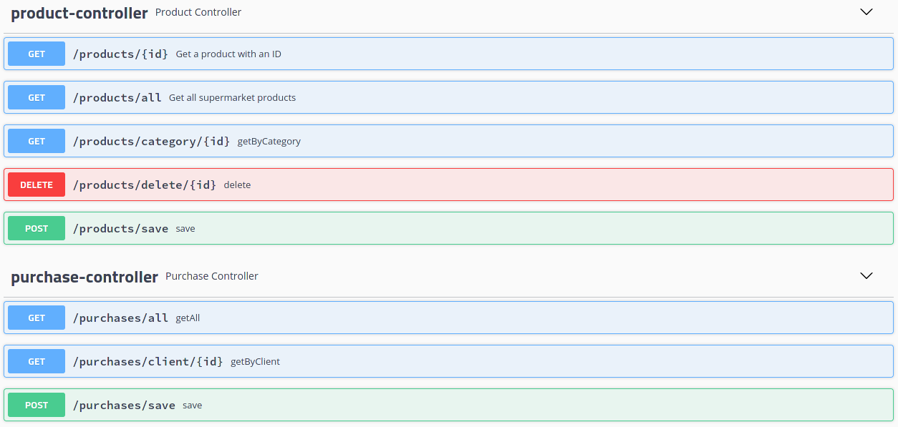
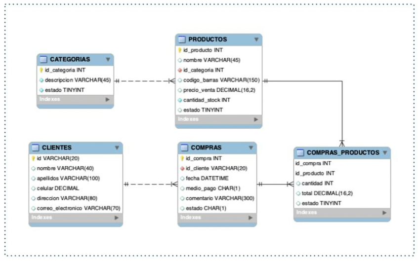

# A Market API

This is a simple, and powerful API for a supermarket. Developed using Java 11 and Spring Boot framework (to learn more about its umbrella projects: Spring DATA JPA, Spring Security, etc).

This project is builded using Gradle to manage its dependencies.

## Methods

## DataModel

The DataBase used to model the Entities is PostgreSQL, and the Model is the next one:

## Tokens

This API is protected with a JWT token, you need to authenticate it with path `/auth/authenticate` to generate a new JWT token and use it in the API requests under **header**  `Authentication: Bearer <token>`.
